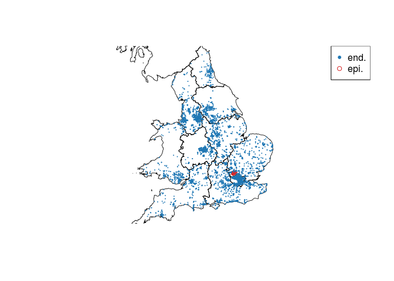
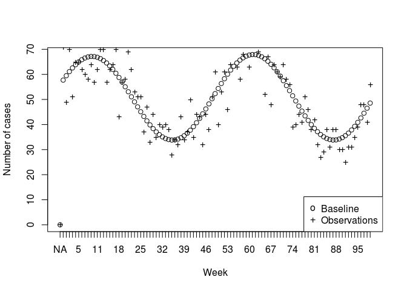
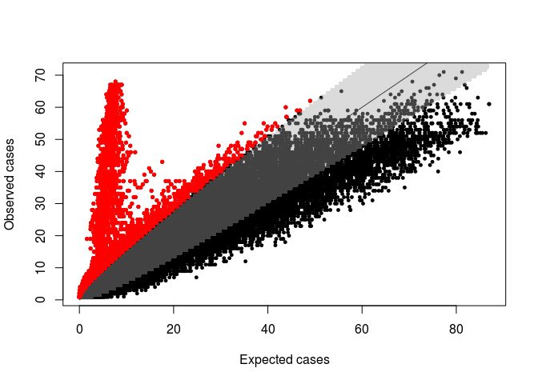

# Rancovr: Cluster detection in R with Random Neighbourhood Covering

`rancovr` is a statistical software package written in R for the
detection of disease clusters. It implements the Random Neighbourhood
Covering (RaNCover) approach of reference \[1\]. RaNCover assigns a
score *w* ∈ \[0, 1\] to each records. A high score suggests that the
record is likely to be part of a cluster (e.g., and infection case
caused by a local outbreak), while a low score suggests consistency with
a baseline of sporadic cases.

``` r
install.packages("devtools")
devtools::install_github("mcavallaro/rancovr")
```

As a demonstration, we consider the spatio-temporal coordinates stored
in `Data/synthetic_dataset.csv`, which represent records of infection
cases and is obtained aggregating data simulated from an endemic
component (`end.`) and from an outbreak (`epi.`) in the UK. See also
reference \[1\] for simulation details.

``` r
data("simulation_data")
head(simulation_data)
```

    ##   postcode week population  sim type latitude longitude        y         x
    ## 1  AL100DR   43         64 epi.    2 51.76370 -0.236058 5756.124 -8.254015
    ## 2  AL100DR   46         64 epi.    1 51.76370 -0.236058 5756.124 -8.254015
    ## 3  AL100DR   57         64 epi.    1 51.76370 -0.236058 5756.124 -8.254015
    ## 4  AL100DR   46         64 epi.    1 51.76370 -0.236058 5756.124 -8.254015
    ## 5  AL100SH   45        127 end.    1 51.76094 -0.238136 5755.816 -8.328354
    ## 6  AL100SH   48        127 epi.    1 51.76094 -0.238136 5755.816 -8.328354

``` r
data("GB_region_boundaries")
plotBaseMap(add=F, xlim=range(simulation_data$longitude), ylim=range(simulation_data$latitude))
points(simulation_data$longitude, simulation_data$latitude,
       col=ifelse(simulation_data$sim=='epi.', tab.red, tab.blue),
       pch=ifelse(simulation_data$sim=='epi.', 1, 20),
       cex=ifelse(simulation_data$sim=='epi.', 0.6, 0.2))
legend('topright',c('end.','epi.'), pch=c(20,1), col=c(tab.blue, tab.red))
```

 For
convenience, all observations are arranged in a `sparseMatrix` object
named `observation.matrix` and saved on disk.

``` r
CreateObservationMatrices(simulation_data)
```

    ## The variable `observation.matrix` has been saved on disk in file `/home/massimo/Documents/rancovr/observation_matrix.RData`.
    ## Load on memory with `load("/home/massimo/Documents/rancovr/observation_matrix.RData", verbose=1)`.

Observations must be compared with an appropriate baseline model. If
their number significantly exceeded the model prediction, an outbreak
might be in progress. Estimating the baseline involves finding a
temporal trend with `TimeFactor` and a spatial trend based on the
spatial population distribution.

``` r
load(file.path(getwd(), "observation_matrix.RData"), verbose=1)
```

    ## Loading objects:
    ##   observation.matrix

``` r
time.factor = TimeFactor(simulation_data, n.iterations=2)
```

    ## Computing the temporal baseline.
    ## Estimating parameters for temporal trend, step  1  of  2 .Estimating parameters for temporal trend, step  2  of  2 .The variable `Parameters` has been saved on disk in file `/home/massimo/Documents/rancovr/timefactor_parameters.RData`.
    ## Load on memory with `load("/home/massimo/Documents/rancovr/timefactor_parameters.RData", verbose=1)`.
    ## The variable `time.factor` has been saved on disk in file `/home/massimo/Documents/rancovr/timefactor.RData`.
    ## Load on memory with `load("/home/massimo/Documents/rancovr/timefactor.RData", verbose=1)`.

``` r
baseline.matrix = CreateBaselineMatrix(simulation_data, save.on.dir = T)
```

    ## Temporal baseline loaded.
    ## Compiling the table that maps the rows of the observation/baseline matrix to geo-coordinates and population.
    ## Loading objects:
    ##   postcode2coord

    ## Warning in as.character(postcode2coord[, postcode.field]) == rownames(matrix):
    ## longer object length is not a multiple of shorter object length

    ## Data loaded from `postcode2coord.RData` is for a different matrix and will be overwritten by the map for the current matrix.
    ## The variable `postcode2coord` has been saved on disk in file `/home/massimo/Documents/rancovr/postcode2coord.RData`.
    ## Load on memory with `load("/home/massimo/Documents/rancovr/postcode2coord.RData", verbose=1)`.
    ## The variable `baseline.matrix` has been saved on disk in file `/home/massimo/Documents/rancovr/baseline_matrix.RData`.
    ## Load on memory with `load("/home/massimo/Documents/rancovr/baseline_matrix.RData", verbose=1)`.

``` r
load(file.path(getwd(), "observation_matrix.RData"), verbose=1)
```

    ## Loading objects:
    ##   observation.matrix

``` r
plot(time.factor, xlab = 'Week', ylab='Number of cases', xaxt='n')
# lines(colSums(baseline.matrix))
points(Matrix::colSums(observation.matrix), pch='+')
axis(side=1, at=1:length(time.factor), labels = names(time.factor))
legend('bottomright',legend=c('Baseline', 'Observations'), pch=c('o', '+'))
```



Create 10,000 cylinders to cover the observed cases using the estimated
baseline.

``` r
cylinders = CreateCylinders(observation.matrix, baseline.matrix, week.range = c(0,99), n.cylinders = 10000)
```

    ## Compiling the table that maps the rows of the observation/baseline matrix to geo-coordinates and population.
    ## Loading objects:
    ##   postcode2coord
    ## Using data loaded from `postcode2coord.RData`
    ## Evaluating cylinder exceedances from  01/01/15  to  24/11/16 .
    ## Time difference of 9.876127 secs

``` r
head(cylinders)
```

    ##            x        y       rho t.low t.upp n_obs        mu      p.val warning
    ## 1  -18.16072 5763.851  6.192814     0    14     2 2.1668782 0.63728284   FALSE
    ## 2  -70.10432 5642.778  8.192323    28    41     3 4.4986442 0.82626937   FALSE
    ## 3  -55.09525 5961.819  6.345746     0    21     9 8.0411532 0.41319689   FALSE
    ## 4  -88.65540 5717.108 10.033506    23    32    12 6.0616573 0.02151707    TRUE
    ## 5 -190.66422 5619.282  9.459680    21    31     1 0.0417387 0.04087963    TRUE
    ## 6  -50.15022 5895.504 10.726269    12    20     5 4.9608022 0.55260204   FALSE

Some cylinders contain much more cases than the baseline expectation:

``` r
plotCylindersCI(cylinders, confidence.level = 0.95)
```



The “true” baseline matrix used to generate the endemic events is
available as `data()`. Let’s use it place of the estimated baseline
matrix. Notice that this has higher dimensionality than the estimated
baseline matrix and requires a matching observation matrix.

``` r
print(dim(baseline.matrix))
```

    ## [1] 3437  101

``` r
print(dim(observation.matrix))
```

    ## [1] 3437  101

``` r
data(baseline_for_sim)
print(dim(baseline_for_sim))
```

    ## [1] 10000   101

``` r
CreateObservationMatrices(simulation_data,
                          more.postcodes=rownames(baseline_for_sim),
                          more.weeks=colnames(baseline_for_sim))
```

    ## Warning in unlist(as.integer(more.weeks)): NAs introduced by coercion

    ## Warning in unlist(as.integer(more.weeks)): NAs introduced by coercion

    ## The variable `observation.matrix` has been saved on disk in file `/home/massimo/Documents/rancovr/observation_matrix.RData`.
    ## Load on memory with `load("/home/massimo/Documents/rancovr/observation_matrix.RData", verbose=1)`.

``` r
load("/home/massimo/Documents/rancovr/observation_matrix.RData", verbose=1)
```

    ## Loading objects:
    ##   observation.matrix

``` r
print(dim(observation.matrix))
```

    ## [1] 10000   101

``` r
cylinders.2 = CreateCylinders(observation.matrix, baseline_for_sim, week.range = c(0,99), n.cylinders = 10000)
```

    ## Compiling the table that maps the rows of the observation/baseline matrix to geo-coordinates and population.
    ## Loading objects:
    ##   postcode2coord

    ## Warning in as.character(postcode2coord[, postcode.field]) == rownames(matrix):
    ## longer object length is not a multiple of shorter object length

    ## Data loaded from `postcode2coord.RData` is for a different matrix and will be overwritten by the map for the current matrix.
    ## The variable `postcode2coord` has been saved on disk in file `/home/massimo/Documents/rancovr/postcode2coord.RData`.
    ## Load on memory with `load("/home/massimo/Documents/rancovr/postcode2coord.RData", verbose=1)`.
    ## Evaluating cylinder exceedances from  01/01/15  to  24/11/16 .
    ## Time difference of 16.59341 secs

``` r
head(cylinders.2)
```

    ##              x        y       rho t.low t.upp n_obs        mu        p.val
    ## 1    0.1985695 5746.081 14.399495    46    51    44 15.583102 2.928384e-09
    ## 2 -111.1596446 5736.521  8.683222    30    42     7  4.995502 2.371591e-01
    ## 3  -81.8429208 5962.442 14.399495    10    15    13  7.689801 5.000908e-02
    ## 4  -37.4708644 6117.299  6.984781     2    20     6 11.408905 9.706869e-01
    ## 5  -38.8795634 5954.730  7.696854    65    80    10  7.981703 2.811081e-01
    ## 6    0.1922021 5712.078  7.987403    76    90     9 13.242969 9.108448e-01
    ##   warning
    ## 1    TRUE
    ## 2   FALSE
    ## 3   FALSE
    ## 4   FALSE
    ## 5   FALSE
    ## 6   FALSE

``` r
plotCylindersCI(cylinders.2, confidence.level = 0.95)
```


Compute the warning scores for each case:

``` r
simulation_data[,'warning.score'] = apply(simulation_data, 1, FUN=warning.score, cylinders)
simulation_data[,'warning.score.2'] = apply(simulation_data, 1, FUN=warning.score, cylinders.2)
head(simulation_data)
```

    ##   postcode week population  sim type latitude longitude        y         x
    ## 1  AL100DR   43         64 epi.    2 51.76370 -0.236058 5756.124 -8.254015
    ## 2  AL100DR   46         64 epi.    1 51.76370 -0.236058 5756.124 -8.254015
    ## 3  AL100DR   57         64 epi.    1 51.76370 -0.236058 5756.124 -8.254015
    ## 4  AL100DR   46         64 epi.    1 51.76370 -0.236058 5756.124 -8.254015
    ## 5  AL100SH   45        127 end.    1 51.76094 -0.238136 5755.816 -8.328354
    ## 6  AL100SH   48        127 epi.    1 51.76094 -0.238136 5755.816 -8.328354
    ##   warning.score warning.score.2
    ## 1     0.9558824       0.9672131
    ## 2     1.0000000       0.9873418
    ## 3     0.8269231       0.8620690
    ## 4     1.0000000       0.9873418
    ## 5     1.0000000       1.0000000
    ## 6     1.0000000       1.0000000

Assess concordance with ROC-AUC:

``` r
library(pROC)
```

    ## Type 'citation("pROC")' for a citation.

    ## 
    ## Attaching package: 'pROC'

    ## The following objects are masked from 'package:stats':
    ## 
    ##     cov, smooth, var

``` r
ROC = roc(ifelse(simulation_data$sim == 'end.', FALSE, TRUE), simulation_data$warning.score)
```

    ## Setting levels: control = FALSE, case = TRUE

    ## Setting direction: controls < cases

``` r
plot(ROC)
ROC = roc(ifelse(simulation_data$sim == 'end.', FALSE, TRUE), simulation_data$warning.score.2)
```

    ## Setting levels: control = FALSE, case = TRUE
    ## Setting direction: controls < cases

``` r
plot(ROC, add=T, col='red')
legend('bottomright', legend =  c('Using estimated baseline', 'Using true baseline'), lty=1, col=c('black','red'))
```


With mean squared error:

``` r
simulation_data$y = ifelse(simulation_data$sim == 'epi.',1,0)
simulation_data$sqerr = (simulation_data$y - simulation_data$warning.score)^2
cat("MSE using estimated baseline:", mean(simulation_data$sqerr), '\n') 
```

    ## MSE using estimated baseline: 0.03570108

``` r
simulation_data$sqerr.2 = (simulation_data$y - simulation_data$warning.score.2)^2
cat("MSE using true baseline:",mean(simulation_data$sqerr.2), '\n') 
```

    ## MSE using true baseline: 0.04586054

And with a map:

``` r
# plotBaseMap(add=F, xlim=c(-0.6,0.6), ylim=c(51.648,51.65))
plotBaseMap(add=F, xlim=c(-1,1), ylim=c(50.648,52.65))
points(simulation_data$longitude, simulation_data$latitude,
       col=ifelse(simulation_data$sim=='epi.', tab.red, tab.blue),
       pch=ifelse(simulation_data$sim=='epi.', 4, 20),
       cex=ifelse(simulation_data$sim=='epi.', 1, 0.5))
points(simulation_data[simulation_data$warning.score.2>0.95,]$longitude, simulation_data[simulation_data$warning.score.2>0.95,]$latitude,
       col=tab.orange,
       pch=1,
       cex=1)
# case.df$color = rgb(colorRamp(c("blue", "red"))(case.df$warning.score) / 255)
# plot(case.df$longitude, case.df$latitude, col=case.df$color)

legend('topright',c('end.','true epi.', 'w>0.95'), pch=c(20,4,1), col=c(tab.blue, tab.red, tab.orange))
```


\[1\] M. Cavallaro, J. Coelho, D. Ready, V. Decraene, T. Lamagni, N. D.
McCarthy, D. Todkill, M. J. Keeling, Cluster detection with random
neighbourhood covering: application to invasive Group A Streptococcal
disease, 2021 medRxiv 2021.10.20.21264984; doi:
<https://doi.org/10.1101/2021.10.20.21264984>
