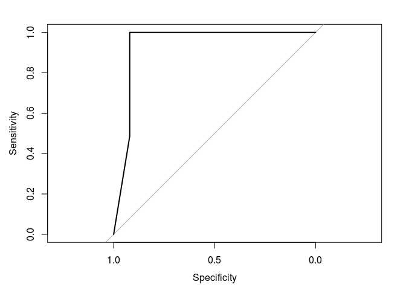

``` r
knitr::opts_knit$set(root.dir = "~/Documents/Rancovr")
devtools::load_all(".")
```

    ## Loading rancovr

Rancovr: Cluster detection with Random Neighbourhood Covering
=============================================================

`rancovr` is a statistical software package written in R for the detection of disease clusters based on the Random Neighbourhood Covering (RaNCover) of reference \[1\]. `rancovr` assess whether a single recorded infection is part of a disease cluster (such that caused by a local outbreak) or is consistent with a baseline of sporadic cases.

<!-- ```{r eval=FALSE, include=TRUE} -->
<!-- install.packages("devtools") -->
<!-- devtools::install_github("mcavallaro/rancovr") -->
<!-- ``` -->
As a demonstration, we consider the spatio-temporal coordinates stored in `Data/synthetic_dataset.csv`, which represent records of infection cases and is obtained aggregating data simulated from an endemic component (`end.`) and from an outbreak (`epi.`) in UK. See reference \[1\] for the simulation details.

``` r
case.df = read.csv(file='Data/synthetic_dataset.csv', sep = ',', stringsAsFactors = F)
head(case.df)
```

    ##   week postcode latitude longitude population        y         x
    ## 1    0  B14 6TN 52.42452 -1.906414         80 5829.607 -63.43771
    ## 2    0  B15 2BQ 52.47047 -1.908348         59 5834.716 -63.27718
    ## 3    0  B42 2RZ 52.53757 -1.902311        177 5842.178 -62.74949
    ## 4    0  B61 0DB 52.34426 -2.052947         18 5820.682 -68.73608
    ## 5    0  B91 3GX 52.40486 -1.775618         17 5827.421 -59.17484
    ## 6    0  BH178AN 50.75126 -1.961944        128 5643.541 -73.64748
    ##   warning.score  sim
    ## 1     0.1538462 end.
    ## 2     0.1339286 end.
    ## 3     0.1220339 end.
    ## 4     0.1150442 end.
    ## 5     0.1717557 end.
    ## 6     0.1230769 end.

``` r
CreateObservationMatrices(case.df)
```

    ## The variable `observation.matrix` has been saved on disk in file `/home/massimo/Documents/Rancovr/observation_matrix_tmp.Rdata`.
    ## Load on memory with `load("/home/massimo/Documents/Rancovr/observation_matrix_tmp.Rdata", verbose=1)`.

``` r
time.factor = TimeFactor(case.df)
```

    ## Computing the temporal baseline.
    ## Estimating parameters for temporal trend, step  1  of  10 .
    Estimating parameters for temporal trend, step  2  of  10 .
    Estimating parameters for temporal trend, step  3  of  10 .
    Estimating parameters for temporal trend, step  4  of  10 .
    Estimating parameters for temporal trend, step  5  of  10 .
    Estimating parameters for temporal trend, step  6  of  10 .
    Estimating parameters for temporal trend, step  7  of  10 .
    Estimating parameters for temporal trend, step  8  of  10 .
    Estimating parameters for temporal trend, step  9  of  10 .
    Estimating parameters for temporal trend, step  10  of  10 .
    The variable `time.factor` has been saved on disk in file `/home/massimo/Documents/Rancovr/timefactor_tmp.Rdata`.
    ## Load on memory with `load("/home/massimo/Documents/Rancovr/timefactor_tmp.Rdata", verbose=1)`.

``` r
baseline.matrix = CreateBaselineMatrix(case.df , save.on.dir = T)
```

    ## Temporal baseline loaded.
    ## Compiling the table that maps the rows of the observation matrix to geo-coordinates and population.
    ## Loading objects:
    ##   postcode2coord
    ## Using data loaded from `Data/postcode2coord.Rdata`
    ## The variable `baseline.matrix` has been saved on disk in file `/home/massimo/Documents/Rancovr/baseline_matrix_tmp.Rdata`.
    ## Load on memory with `load("/home/massimo/Documents/Rancovr/baseline_matrix_tmp.Rdata", verbose=1)`.

``` r
load(file.path(getwd(), "observation_matrix_tmp.Rdata"), verbose=1)
```

    ## Loading objects:
    ##   observation.matrix

``` r
plot(time.factor, xlab = 'week', xaxt='n')
lines(colSums(baseline.matrix))
lines(colSums(observation.matrix))
axis(side=1, at=1:length(time.factor), labels = names(time.factor))
```


Create 100,000 cyclinders to cover the detected cases:

``` r
cylinders = CreateCylinders(observation.matrix = observation.matrix,
                            baseline.matrix = baseline.matrix,
                            week.range = c(0,99), n.cylinders = 1000)
```

    ## Evaluating cylinder exceedances from  01/01/15  to  24/11/16 .
    ## Time difference of 0.9325681 secs

``` r
head(cylinders)
```

    ##            x        y       rho t.low t.upp n_obs        mu     p.val
    ## 1 -46.992718 5977.970  6.421364    75    96    15 14.958127 0.5300511
    ## 2  -2.441863 5694.662  7.414752    52    68     4  6.675765 0.8996866
    ## 3 -43.553823 5923.809 11.723753    17    24     4  7.017125 0.9191229
    ## 4 -41.212046 5939.494  9.081180    48    59     8 12.661917 0.9356838
    ## 5 -44.571110 5980.230  5.987953    70    94    19 22.870920 0.8184250
    ## 6  52.512579 5708.980 16.579890    16    20     1  2.732871 0.9349677
    ##   warning
    ## 1   FALSE
    ## 2   FALSE
    ## 3   FALSE
    ## 4   FALSE
    ## 5   FALSE
    ## 6   FALSE

Compute the warning score for each case:

``` r
case.df[,'warning.score'] = apply(case.df, 1, FUN=warning.score, cylinders)
head(case.df)
```

    ##   week postcode latitude longitude population        y         x
    ## 1    0  B14 6TN 52.42452 -1.906414         80 5829.607 -63.43771
    ## 2    0  B15 2BQ 52.47047 -1.908348         59 5834.716 -63.27718
    ## 3    0  B42 2RZ 52.53757 -1.902311        177 5842.178 -62.74949
    ## 4    0  B61 0DB 52.34426 -2.052947         18 5820.682 -68.73608
    ## 5    0  B91 3GX 52.40486 -1.775618         17 5827.421 -59.17484
    ## 6    0  BH178AN 50.75126 -1.961944        128 5643.541 -73.64748
    ##   warning.score  sim
    ## 1             0 end.
    ## 2             0 end.
    ## 3             0 end.
    ## 4             0 end.
    ## 5             0 end.
    ## 6             0 end.

Assess concordance with ROC-ACU

``` r
library(pROC)
```

    ## Type 'citation("pROC")' for a citation.

    ## 
    ## Attaching package: 'pROC'

    ## The following objects are masked from 'package:stats':
    ## 
    ##     cov, smooth, var

``` r
ROC = roc(ifelse(case.df$sim == 'end.', FALSE, TRUE), case.df$warning.score)
```

    ## Setting levels: control = FALSE, case = TRUE

    ## Setting direction: controls < cases

``` r
plot(ROC)
```



\[1\] M. Cavallaro, J. Coelho, D. Ready, V. Decraene, T. Lamagni, N. D. McCarthy, D. Todkill, M. J. Keeling, Cluster detection with random neighbourhood covering: application to invasive Group A Streptococcal disease, 2021
