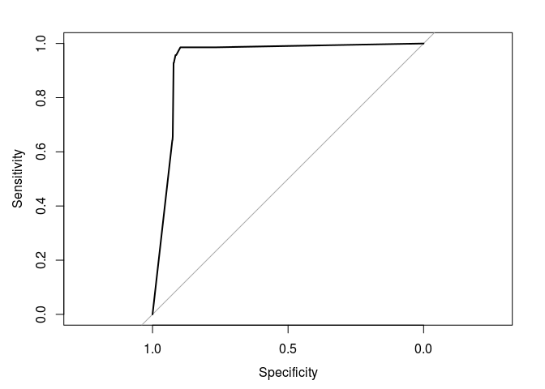

# Rancovr: Cluster detection in R with Random Neighbourhood Covering

`rancovr` is a statistical software package written in R for the
detection of disease clusters based on the Random Neighbourhood Covering
(RaNCover) of reference \[1\]. `rancovr` assess whether a single
recorded infection is part of a disease cluster (such that caused by a
local outbreak) or is consistent with a baseline of sporadic cases.

``` r
install.packages("devtools")
devtools::install_github("mcavallaro/rancovr")
```

As a demonstration, we consider the spatio-temporal coordinates stored
in `Data/synthetic_dataset.csv`, which represent records of infection
cases and is obtained aggregating data simulated from an endemic
component (`end.`) and from an outbreak (`epi.`) in the UK. See
reference \[1\] for the simulation details.

``` r
case.df = read.csv(file=system.file('extdata', 'synthetic_dataset.csv' , package='rancovr'), sep = ',', stringsAsFactors = F)
```

``` r
head(case.df)
```

    ##   week postcode latitude longitude population        y         x warning.score
    ## 1    0  B14 6TN 52.42452 -1.906414         80 5829.607 -63.43771     0.1538462
    ## 2    0  B15 2BQ 52.47047 -1.908348         59 5834.716 -63.27718     0.1339286
    ## 3    0  B42 2RZ 52.53757 -1.902311        177 5842.178 -62.74949     0.1220339
    ## 4    0  B61 0DB 52.34426 -2.052947         18 5820.682 -68.73608     0.1150442
    ## 5    0  B91 3GX 52.40486 -1.775618         17 5827.421 -59.17484     0.1717557
    ## 6    0  BH178AN 50.75126 -1.961944        128 5643.541 -73.64748     0.1230769
    ##    sim
    ## 1 end.
    ## 2 end.
    ## 3 end.
    ## 4 end.
    ## 5 end.
    ## 6 end.

``` r
CreateObservationMatrices(case.df)
```

    ## The variable `observation.matrix` has been saved on disk in file `/home/massimo/Documents/rancovr/observation_matrix_tmp.Rdata`.
    ## Load on memory with `load("/home/massimo/Documents/rancovr/observation_matrix_tmp.Rdata", verbose=1)`.

``` r
time.factor = TimeFactor(case.df, n.iterations=5)
```

    ## Computing the temporal baseline.
    ## Estimating parameters for temporal trend, step  1  of  5 .Estimating parameters for temporal trend, step  2  of  5 .Estimating parameters for temporal trend, step  3  of  5 .Estimating parameters for temporal trend, step  4  of  5 .Estimating parameters for temporal trend, step  5  of  5 .The variable `time.factor` has been saved on disk in file `/home/massimo/Documents/rancovr/timefactor_tmp.Rdata`.
    ## Load on memory with `load("/home/massimo/Documents/rancovr/timefactor_tmp.Rdata", verbose=1)`.

``` r
baseline.matrix = CreateBaselineMatrix(case.df , save.on.dir = T)
```

    ## Temporal baseline loaded.
    ## Compiling the table that maps the rows of the observation/baseline matrix to geo-coordinates and population.
    ## Loading objects:
    ##   postcode2coord
    ## The variable `postcode2coord` has been saved on disk in file `/home/massimo/Documents/rancovr/postcode2coord_tmp.Rdata`.
    ## Load on memory with `load("/home/massimo/Documents/rancovr/postcode2coord_tmp.Rdata", verbose=1)`.
    ## The variable `baseline.matrix` has been saved on disk in file `/home/massimo/Documents/rancovr/baseline_matrix_tmp.Rdata`.
    ## Load on memory with `load("/home/massimo/Documents/rancovr/baseline_matrix_tmp.Rdata", verbose=1)`.

``` r
load(file.path(getwd(), "observation_matrix_tmp.Rdata"), verbose=1)
```

    ## Loading objects:
    ##   observation.matrix

``` r
plot(time.factor, xlab = 'Week', ylab='Number of cases', xaxt='n')
lines(colSums(baseline.matrix))
lines(colSums(observation.matrix))
axis(side=1, at=1:length(time.factor), labels = names(time.factor))
legend('bottomright',legend=c('Baseline', 'Observations'), pch=c(1, NA), lty=c(1,1))
```


Create 100,000 cyclinders to cover the detected cases:

``` r
cylinders = CreateCylinders(observation.matrix = observation.matrix,
                            baseline.matrix = baseline.matrix,
                            week.range = c(0,99), n.cylinders = 1000)
```

    ## Compiling the table that maps the rows of the observation/baseline matrix to geo-coordinates and population.
    ## Loading objects:
    ##   postcode2coord
    ## Using data loaded from `postcode2coord_tmp.Rdata`
    ## Evaluating cylinder exceedances from  01/01/15  to  24/11/16 .
    ## Time difference of 1.316543 secs

``` r
head(cylinders)
```

    ##            x        y       rho t.low t.upp n_obs        mu     p.val warning
    ## 1 -43.169149 6116.120  6.420488    28    49     6 13.258411 0.9909365   FALSE
    ## 2 -32.609732 5888.756  8.288814    24    37     6  5.938776 0.5444368   FALSE
    ## 3  -7.155693 5733.300  7.178324    42    59    33 46.761937 0.9854460   FALSE
    ## 4  -4.269844 5742.414 12.840976    72    78    22 33.854769 0.9876622   FALSE
    ## 5 -21.449581 6015.950  7.963635    68    82     1  0.000000 0.0000000    TRUE
    ## 6 -67.040900 5828.258 12.840976    59    65    10 21.062282 0.9973360   FALSE

Compute the warning score for each case:

``` r
case.df[,'warning.score'] = apply(case.df, 1, FUN=warning.score, cylinders)
head(case.df)
```

    ##   week postcode latitude longitude population        y         x warning.score
    ## 1    0  B14 6TN 52.42452 -1.906414         80 5829.607 -63.43771             0
    ## 2    0  B15 2BQ 52.47047 -1.908348         59 5834.716 -63.27718             0
    ## 3    0  B42 2RZ 52.53757 -1.902311        177 5842.178 -62.74949             0
    ## 4    0  B61 0DB 52.34426 -2.052947         18 5820.682 -68.73608             0
    ## 5    0  B91 3GX 52.40486 -1.775618         17 5827.421 -59.17484             0
    ## 6    0  BH178AN 50.75126 -1.961944        128 5643.541 -73.64748             0
    ##    sim
    ## 1 end.
    ## 2 end.
    ## 3 end.
    ## 4 end.
    ## 5 end.
    ## 6 end.

Assess concordance with ROC-ACU

``` r
library(pROC)
```

    ## Type 'citation("pROC")' for a citation.

    ## 
    ## Attaching package: 'pROC'

    ## The following objects are masked from 'package:stats':
    ## 
    ##     cov, smooth, var

``` r
ROC = roc(ifelse(case.df$sim == 'end.', FALSE, TRUE), case.df$warning.score)
```

    ## Setting levels: control = FALSE, case = TRUE

    ## Setting direction: controls < cases

``` r
plot(ROC)
```



\[1\] M. Cavallaro, J. Coelho, D. Ready, V. Decraene, T. Lamagni, N. D.
McCarthy, D. Todkill, M. J. Keeling, Cluster detection with random
neighbourhood covering: application to invasive Group A Streptococcal
disease, 2021
