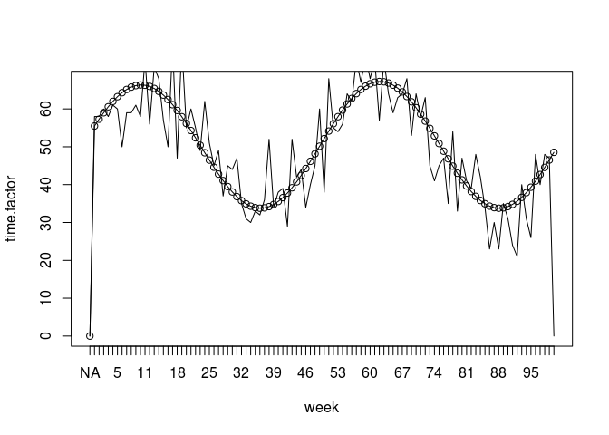
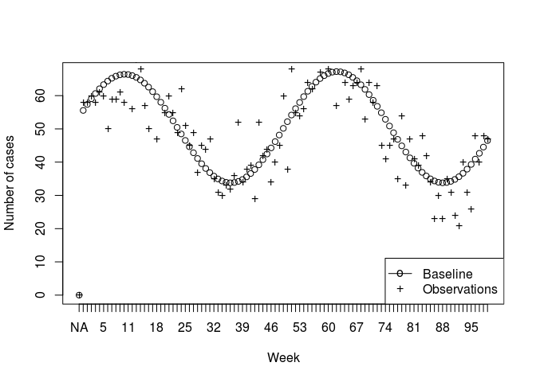
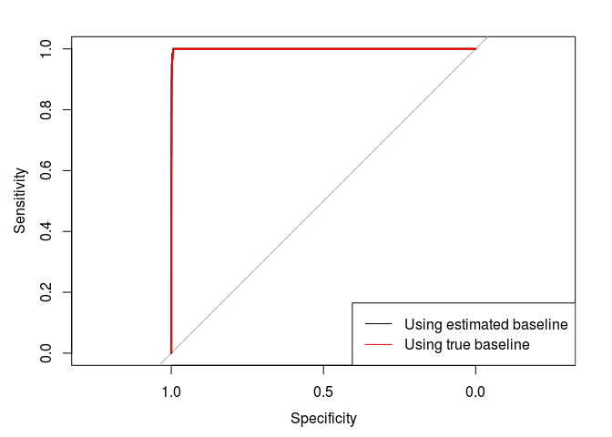
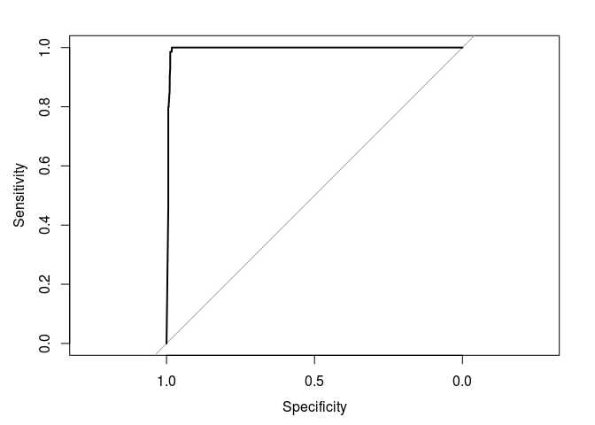

# Rancovr: Cluster detection in R with Random Neighbourhood Covering

`rancovr` is a statistical software package written in R for the
detection of disease clusters. It implements the Random Neighbourhood
Covering (RaNCover) approach of reference \[1\]. RaNCover assigns a
score *w* ∈ \[0, 1\] to each records. A high score suggests that the
record is likely to be part of a cluster (e.g., and infection case
caused by a local outbreak).

``` r
install.packages("devtools")
devtools::install_github("mcavallaro/rancovr")
```

As a demonstration, we consider the spatio-temporal coordinates stored
in `Data/synthetic_dataset.csv`, which represent records of infection
cases and is obtained aggregating data simulated from an endemic
component (`end.`) and from an outbreak (`epi.`) in the UK. See
reference \[1\] for the simulation details.

``` r
case.df = read.csv(file=system.file('extdata', 'synthetic_dataset.csv' , package='rancovr'), sep = ',', stringsAsFactors = F)
```

``` r
head(case.df)
```

    ##   week postcode latitude longitude population        y         x warning.score
    ## 1    0  B14 6TN 52.42452 -1.906414         80 5829.607 -63.43771     0.1538462
    ## 2    0  B15 2BQ 52.47047 -1.908348         59 5834.716 -63.27718     0.1339286
    ## 3    0  B42 2RZ 52.53757 -1.902311        177 5842.178 -62.74949     0.1220339
    ## 4    0  B61 0DB 52.34426 -2.052947         18 5820.682 -68.73608     0.1150442
    ## 5    0  B91 3GX 52.40486 -1.775618         17 5827.421 -59.17484     0.1717557
    ## 6    0  BH178AN 50.75126 -1.961944        128 5643.541 -73.64748     0.1230769
    ##    sim
    ## 1 end.
    ## 2 end.
    ## 3 end.
    ## 4 end.
    ## 5 end.
    ## 6 end.

``` r
plotBaseMap(add=F, xlim=range(case.df$longitude), ylim=range(case.df$latitude))
points(case.df$longitude, case.df$latitude,
       col=ifelse(case.df$sim=='epi.', tab.red, tab.blue),
       pch=ifelse(case.df$sim=='epi.', 1, 20),
       cex=ifelse(case.df$sim=='epi.', 0.6, 0.2))
legend('topright',c('end.','epi.'), pch=c(20,1), col=c(tab.blue, tab.red))
```



``` r
CreateObservationMatrices(case.df)
```

    ## The variable `observation.matrix` has been saved on disk in file `/home/massimo/Documents/rancovr/observation_matrix_tmp.Rdata`.
    ## Load on memory with `load("/home/massimo/Documents/rancovr/observation_matrix_tmp.Rdata", verbose=1)`.

``` r
time.factor = TimeFactor(case.df, n.iterations=5)
```

    ## Computing the temporal baseline.
    ## Estimating parameters for temporal trend, step  1  of  5 .Estimating parameters for temporal trend, step  2  of  5 .Estimating parameters for temporal trend, step  3  of  5 .Estimating parameters for temporal trend, step  4  of  5 .Estimating parameters for temporal trend, step  5  of  5 .The variable `Parameters` has been saved on disk in file `/home/massimo/Documents/rancovr/timefactor_parameters_tmp.Rdata`.
    ## Load on memory with `load("/home/massimo/Documents/rancovr/timefactor_parameters_tmp.Rdata", verbose=1)`.
    ## The variable `time.factor` has been saved on disk in file `/home/massimo/Documents/rancovr/timefactor_tmp.Rdata`.
    ## Load on memory with `load("/home/massimo/Documents/rancovr/timefactor_tmp.Rdata", verbose=1)`.

``` r
#baseline.matrix = CreateBaselineMatrix(case.df , save.on.dir = T)
```

``` r
baseline.tab = tabulated.baseline(case.df)
```

    ## Bandwidths are:  0.6592537 1.778171 
    ## Grid size:  416 x 353

``` r
library(Matrix)
load(file.path(getwd(), "observation_matrix_tmp.Rdata"), verbose=1)
```

    ## Loading objects:
    ##   observation.matrix

``` r
plot(time.factor, xlab = 'Week', ylab='Number of cases', xaxt='n')
# lines(colSums(baseline.matrix))
points(colSums(observation.matrix), pch='+')
axis(side=1, at=1:length(time.factor), labels = names(time.factor))
legend('bottomright',legend=c('Baseline', 'Observations'), pch=c('o', '+'), lty=c(1, NA))
```



Create 10,000 cylinders to cover the detected cases:

``` r
cylinders = CreateCylinders(observation.matrix, baseline.tab, week.range = c(0,99), n.cylinders = 10000)
head(cylinders)
```

Some cylinders contain much more cases than the baseline expectation:

``` r
plotCylindersCI(cylinders, confidence.level = 0.95)
```



Compute the warning score for each case:

``` r
case.df[,'warning.score'] = apply(case.df, 1, FUN=warning.score, cylinders)
head(case.df)
```

    ##   week postcode latitude longitude population        y         x warning.score
    ## 1    0  B14 6TN 52.42452 -1.906414         80 5829.607 -63.43771     0.2500000
    ## 2    0  B15 2BQ 52.47047 -1.908348         59 5834.716 -63.27718     0.2000000
    ## 3    0  B42 2RZ 52.53757 -1.902311        177 5842.178 -62.74949     0.1666667
    ## 4    0  B61 0DB 52.34426 -2.052947         18 5820.682 -68.73608     0.5000000
    ## 5    0  B91 3GX 52.40486 -1.775618         17 5827.421 -59.17484     0.3000000
    ## 6    0  BH178AN 50.75126 -1.961944        128 5643.541 -73.64748     0.0000000
    ##    sim
    ## 1 end.
    ## 2 end.
    ## 3 end.
    ## 4 end.
    ## 5 end.
    ## 6 end.

Assess concordance with ROC-ACU:

``` r
library(pROC)
```

    ## Type 'citation("pROC")' for a citation.

    ## 
    ## Attaching package: 'pROC'

    ## The following objects are masked from 'package:stats':
    ## 
    ##     cov, smooth, var

``` r
ROC = roc(ifelse(case.df$sim == 'end.', FALSE, TRUE), case.df$warning.score)
```

    ## Setting levels: control = FALSE, case = TRUE

    ## Setting direction: controls < cases

``` r
plot(ROC)
```



With mean squared error:

``` r
case.df$y = ifelse(case.df$sim == 'epi.',1,0)
case.df$sqerr = (case.df$y - case.df$warning.score)^2
print(mean(case.df$sqerr))
```

    ## [1] 0.04300681

And with a map:

``` r
plotBaseMap(add=F, xlim=c(-0.6,0.6), ylim=c(51.648,51.65))
#plotBaseMap(add=F, xlim=c(-1,1), ylim=c(50.648,52.65))
points(case.df$longitude, case.df$latitude,
       col=ifelse(case.df$sim=='epi.', tab.red, tab.blue),
       pch=ifelse(case.df$sim=='epi.', 4, 20),
       cex=ifelse(case.df$sim=='epi.', 1, 0.5))
points(case.df[case.df$warning.score>0.95,]$longitude, case.df[case.df$warning.score>0.95,]$latitude,
       col=tab.orange,
       pch=1,
       cex=1)
# case.df$color = rgb(colorRamp(c("blue", "red"))(case.df$warning.score) / 255)
# plot(case.df$longitude, case.df$latitude, col=case.df$color)

legend('topright',c('end.','true epi.', 'w>0.95'), pch=c(20,4,1), col=c(tab.blue, tab.red, tab.orange))
```


\[1\] M. Cavallaro, J. Coelho, D. Ready, V. Decraene, T. Lamagni, N. D.
McCarthy, D. Todkill, M. J. Keeling, Cluster detection with random
neighbourhood covering: application to invasive Group A Streptococcal
disease, 2021 medRxiv 2021.10.20.21264984; doi:
<https://doi.org/10.1101/2021.10.20.21264984>
