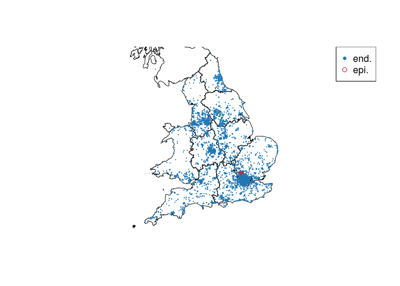

# Rancovr: Cluster detection in R with Random Neighbourhood Covering

`rancovr` is a statistical software package written in R for the
detection of disease clusters. It implements the Random Neighbourhood
Covering (RaNCover) approach of reference \[1\]. RaNCover assigns a
score *w* ∈ \[0, 1\] to each records. A high score suggests that the
record is likely to be part of a cluster (e.g., and infection case
caused by a local outbreak), while a low score suggests that the record
is consistent with a baseline of sporadic cases.

``` r
install.packages("devtools")
devtools::install_github("mcavallaro/rancovr")
```

As a demonstration, we consider the spatio-temporal coordinates stored
in `Data/synthetic_dataset.csv`. These represent records of infection
cases, obtained aggregating data simulated from an endemic component
(`end.`) and from an outbreak (`epi.`) in England. See also reference
\[1\] for simulation details.

``` r
data("simulation_data")
head(simulation_data)
```

    ##   postcode week population  sim type latitude  longitude Postcode Total
    ## 1  AL100AZ   59         67 epi.    1 51.76421 -0.2309368  AL100AZ    67
    ## 2  AL100AZ   41         67 epi.    2 51.76421 -0.2309368  AL100AZ    67
    ## 3  AL100AZ   51         67 epi.    2 51.76421 -0.2309368  AL100AZ    67
    ## 4  AL100DR   50         64 epi.    1 51.76370 -0.2360576  AL100DR    64
    ## 5  AL100DR   47         64 epi.    1 51.76370 -0.2360576  AL100DR    64
    ## 6  AL100DR   51         64 epi.    1 51.76370 -0.2360576  AL100DR    64
    ##          y         x
    ## 1 5756.180 -8.074648
    ## 2 5756.180 -8.074648
    ## 3 5756.180 -8.074648
    ## 4 5756.123 -8.254003
    ## 5 5756.123 -8.254003
    ## 6 5756.123 -8.254003

``` r
data("GB_region_boundaries")
plotBaseMap(add=F, xlim=range(simulation_data$longitude), ylim=range(simulation_data$latitude))
points(simulation_data$longitude, simulation_data$latitude,
       col=ifelse(simulation_data$sim=='epi.', tab.red, tab.blue),
       pch=ifelse(simulation_data$sim=='epi.', 1, 20),
       cex=ifelse(simulation_data$sim=='epi.', 0.6, 0.2))
legend('topright',c('end.','epi.'), pch=c(20,1), col=c(tab.blue, tab.red))
```

 For
convenience, all observations are arranged in a `sparseMatrix` object
named `observation.matrix` and saved on disk.

``` r
CreateObservationMatrices(simulation_data)
```

    ## The variable `observation.matrix` has been saved on disk in file `/home/massimo/Documents/rancovr/observation_matrix.RData`.
    ## Load on memory with `load("/home/massimo/Documents/rancovr/observation_matrix.RData", verbose=1)`.

Observations must be compared with an appropriate baseline model. If
their number significantly exceeded the model prediction, an outbreak
might be occurring. Estimating the baseline involves finding a temporal
trend (using the function `TimeFactor`) and a spatial trend based on the
spatial population distribution.

``` r
load(file.path(getwd(), "observation_matrix.RData"), verbose=1)
```

    ## Loading objects:
    ##   observation.matrix

``` r
time.factor = TimeFactor(simulation_data, n.iterations=5)
```

    ## Computing the temporal baseline.
    ## Estimating parameters for temporal trend, step  1  of  5 .Estimating parameters for temporal trend, step  2  of  5 .Estimating parameters for temporal trend, step  3  of  5 .Estimating parameters for temporal trend, step  4  of  5 .Estimating parameters for temporal trend, step  5  of  5 .The variable `Parameters` has been saved on disk in file `/home/massimo/Documents/rancovr/timefactor_parameters.RData`.
    ## Load on memory with `load("/home/massimo/Documents/rancovr/timefactor_parameters.RData", verbose=1)`.
    ## The variable `time.factor` has been saved on disk in file `/home/massimo/Documents/rancovr/timefactor.RData`.
    ## Load on memory with `load("/home/massimo/Documents/rancovr/timefactor.RData", verbose=1)`.

``` r
baseline.matrix = CreateBaselineMatrix(simulation_data, save.on.dir = T)
```

    ## Temporal baseline loaded.
    ## Compiling the table that maps the rows of the observation/baseline matrix to geo-coordinates and population.
    ## Loading objects:
    ##   postcode2coord

    ## Warning in as.character(postcode2coord[, postcode.field]) == rownames(matrix):
    ## longer object length is not a multiple of shorter object length

    ## Data loaded from `postcode2coord.RData` is for a different matrix and will be overwritten by the map for the current matrix.
    ## The variable `postcode2coord` has been saved on disk in file `/home/massimo/Documents/rancovr/postcode2coord.RData`.
    ## Load on memory with `load("/home/massimo/Documents/rancovr/postcode2coord.RData", verbose=1)`.
    ## The variable `baseline.matrix` has been saved on disk in file `/home/massimo/Documents/rancovr/baseline_matrix.RData`.
    ## Load on memory with `load("/home/massimo/Documents/rancovr/baseline_matrix.RData", verbose=1)`.

``` r
load(file.path(getwd(), "observation_matrix.RData"), verbose=1)
```

    ## Loading objects:
    ##   observation.matrix

``` r
plot(time.factor, xlab = 'Week', ylab='Number of cases', xaxt='n')
# lines(colSums(baseline.matrix))
points(Matrix::colSums(observation.matrix), pch='+')
axis(side=1, at=1:length(time.factor), labels = names(time.factor))
legend('bottomright',legend=c('Baseline', 'Observations'), pch=c('o', '+'))
```


Create 100,000 cylinders to cover the observed cases using the estimated
baseline.

``` r
cylinders = CreateCylinders(observation.matrix, baseline.matrix, week.range = c(0,99), n.cylinders = 100000)
```

    ## Compiling the table that maps the rows of the observation/baseline matrix to geo-coordinates and population.
    ## Loading objects:
    ##   postcode2coord
    ## Using data loaded from `postcode2coord.RData`
    ## Evaluating cylinder exceedances from  01/01/15  to  24/11/16 .
    ## Time difference of 1.62046 mins

``` r
head(cylinders)
```

    ##             x        y       rho t.low t.upp n_obs         mu      p.val
    ## 1   -9.512553 5720.063 14.311616    21    26    40 34.5261054 0.19624700
    ## 2  -13.733509 5807.403  7.155808     0    12     1  0.7111017 0.50889716
    ## 3 -134.616336 5623.578  6.746561    52    71     4  1.5466504 0.07163341
    ## 4  -63.364792 5837.851  5.968356    48    72    26 29.5764845 0.76923125
    ## 5  -91.143168 5730.355  6.246101     3    25     7  6.0378388 0.39977477
    ## 6  -44.871282 6112.868  6.102494    14    37    18 11.6333849 0.04996999
    ##   warning
    ## 1   FALSE
    ## 2   FALSE
    ## 3   FALSE
    ## 4   FALSE
    ## 5   FALSE
    ## 6    TRUE

Some cylinders contain much more cases than the baseline expectation.
Such cylinders cover epidemic event.

``` r
plotCylindersCI(cylinders, confidence.level = 0.95)
```


The “true” baseline matrix used to generate the endemic events is
available as `data()`. Let’s use it in place of the estimated baseline
matrix. Notice that the true baseline matrix has higher dimensionality
than the estimated baseline matrix (it includes entries for more
postcodes and times) and requires a matching observation matrix.

``` r
print(dim(baseline.matrix))
```

    ## [1] 3446  101

``` r
print(dim(observation.matrix))
```

    ## [1] 3446  101

``` r
data(baseline_for_sim)
print(dim(baseline_for_sim))
```

    ## [1] 10000   101

``` r
CreateObservationMatrices(simulation_data,
                          more.postcodes=rownames(baseline_for_sim),
                          more.weeks=colnames(baseline_for_sim))
```

    ## Warning in unlist(as.integer(more.weeks)): NAs introduced by coercion

    ## Warning in unlist(as.integer(more.weeks)): NAs introduced by coercion

    ## The variable `observation.matrix` has been saved on disk in file `/home/massimo/Documents/rancovr/observation_matrix.RData`.
    ## Load on memory with `load("/home/massimo/Documents/rancovr/observation_matrix.RData", verbose=1)`.

``` r
load("/home/massimo/Documents/rancovr/observation_matrix.RData", verbose=1)
```

    ## Loading objects:
    ##   observation.matrix

``` r
print(dim(observation.matrix))
```

    ## [1] 10000   101

``` r
cylinders.2 = CreateCylinders(observation.matrix, baseline_for_sim, week.range = c(0,99), n.cylinders = 100000)
```

    ## Compiling the table that maps the rows of the observation/baseline matrix to geo-coordinates and population.
    ## Loading objects:
    ##   postcode2coord

    ## Warning in as.character(postcode2coord[, postcode.field]) == rownames(matrix):
    ## longer object length is not a multiple of shorter object length

    ## Data loaded from `postcode2coord.RData` is for a different matrix and will be overwritten by the map for the current matrix.
    ## The variable `postcode2coord` has been saved on disk in file `/home/massimo/Documents/rancovr/postcode2coord.RData`.
    ## Load on memory with `load("/home/massimo/Documents/rancovr/postcode2coord.RData", verbose=1)`.
    ## Evaluating cylinder exceedances from  01/01/15  to  24/11/16 .
    ## Time difference of 2.642384 mins

``` r
head(cylinders.2)
```

    ##              x        y       rho t.low t.upp n_obs        mu       p.val
    ## 1    5.6383687 5724.717  7.987403    27    41    26 14.068329 0.002776905
    ## 2   -6.9825321 5893.372  9.107041     4    15     4  1.506170 0.066419281
    ## 3  -88.4081075 5932.797  6.984781     0    13     9  7.381465 0.321824199
    ## 4   -1.2414016 5733.114 11.757139    42    49    30 33.839933 0.768372193
    ## 5   -0.5376942 5745.217  7.199748    57    74    18 13.633585 0.147727675
    ## 6 -102.2708911 5726.610  9.107041    80    91     1  1.265458 0.717890066
    ##   warning
    ## 1    TRUE
    ## 2   FALSE
    ## 3   FALSE
    ## 4   FALSE
    ## 5   FALSE
    ## 6   FALSE

``` r
plotCylindersCI(cylinders.2, confidence.level = 0.95)
```


Compute the warning scores for each case:

``` r
simulation_data[,'warning.score'] = apply(simulation_data, 1, FUN=warning.score, cylinders)
simulation_data[,'warning.score.2'] = apply(simulation_data, 1, FUN=warning.score, cylinders.2)
head(simulation_data)
```

    ##   postcode week population  sim type latitude  longitude Postcode Total
    ## 1  AL100AZ   59         67 epi.    1 51.76421 -0.2309368  AL100AZ    67
    ## 2  AL100AZ   41         67 epi.    2 51.76421 -0.2309368  AL100AZ    67
    ## 3  AL100AZ   51         67 epi.    2 51.76421 -0.2309368  AL100AZ    67
    ## 4  AL100DR   50         64 epi.    1 51.76370 -0.2360576  AL100DR    64
    ## 5  AL100DR   47         64 epi.    1 51.76370 -0.2360576  AL100DR    64
    ## 6  AL100DR   51         64 epi.    1 51.76370 -0.2360576  AL100DR    64
    ##          y         x warning.score warning.score.2
    ## 1 5756.180 -8.074648     0.8692308       0.9529412
    ## 2 5756.180 -8.074648     0.8918269       0.9187935
    ## 3 5756.180 -8.074648     0.9714994       0.9910941
    ## 4 5756.123 -8.254003     0.9759036       0.9987294
    ## 5 5756.123 -8.254003     0.9849315       0.9879357
    ## 6 5756.123 -8.254003     0.9742015       0.9911055

Assess concordance with ROC-AUC:

``` r
library(pROC)
```

    ## Type 'citation("pROC")' for a citation.

    ## 
    ## Attaching package: 'pROC'

    ## The following objects are masked from 'package:stats':
    ## 
    ##     cov, smooth, var

``` r
ROC = roc(ifelse(simulation_data$sim == 'end.', FALSE, TRUE), simulation_data$warning.score)
```

    ## Setting levels: control = FALSE, case = TRUE

    ## Setting direction: controls < cases

``` r
plot(ROC)
print(ROC$auc)
```

    ## Area under the curve: 0.9997

``` r
ROC = roc(ifelse(simulation_data$sim == 'end.', FALSE, TRUE), simulation_data$warning.score.2)
```

    ## Setting levels: control = FALSE, case = TRUE
    ## Setting direction: controls < cases

``` r
plot(ROC, add=T, col='red')
print(ROC$auc)
```

    ## Area under the curve: 0.9997

``` r
legend('bottomright', legend =  c('Using estimated baseline', 'Using true baseline'), lty=1, col=c('black','red'))
```


With mean squared error:

``` r
simulation_data$Y = ifelse(simulation_data$sim == 'epi.',1,0)
simulation_data$sqerr = (simulation_data$Y - simulation_data$warning.score)^2
cat("MSE using estimated baseline:", mean(simulation_data$sqerr), '\n') 
```

    ## MSE using estimated baseline: 0.02557394

``` r
simulation_data$sqerr.2 = (simulation_data$Y - simulation_data$warning.score.2)^2
cat("MSE using true baseline:", mean(simulation_data$sqerr.2), '\n') 
```

    ## MSE using true baseline: 0.03922385

And with a map:

``` r
#plotBaseMap(add=F, xlim=c(-0.6,0.6), ylim=c(51.648,51.65))
plotBaseMap(add=F, xlim=c(-1,1), ylim=c(50.648,52.65))
points(simulation_data$longitude, simulation_data$latitude,
       col=ifelse(simulation_data$sim=='epi.', tab.red, tab.blue),
       pch=ifelse(simulation_data$sim=='epi.', 4, 20),
       cex=ifelse(simulation_data$sim=='epi.', 1, 0.5))
points(simulation_data[simulation_data$warning.score>0.95,]$longitude,
       simulation_data[simulation_data$warning.score>0.95,]$latitude,
       col=tab.orange,
       pch=1,
       cex=1)
# case.df$color = rgb(colorRamp(c("blue", "red"))(case.df$warning.score) / 255)
# plot(case.df$longitude, case.df$latitude, col=case.df$color)

legend('topright',c('end.','true epi.', 'w>0.95'), pch=c(20,4,1), col=c(tab.blue, tab.red, tab.orange))
```


``` r
plotBaseMap(add=F, xlim=c(-0.6,0.6), ylim=c(51.648,51.65))
#plotBaseMap(add=F, xlim=c(-1,1), ylim=c(50.648,52.65))
points(simulation_data$longitude, simulation_data$latitude,
       col=ifelse(simulation_data$sim=='epi.', tab.red, tab.blue),
       pch=ifelse(simulation_data$sim=='epi.', 4, 20),
       cex=ifelse(simulation_data$sim=='epi.', 1, 0.5))
points(simulation_data[simulation_data$warning.score.2>0.95,]$longitude,
       simulation_data[simulation_data$warning.score.2>0.95,]$latitude,
       col=tab.orange,
       pch=1,
       cex=1)
# case.df$color = rgb(colorRamp(c("blue", "red"))(case.df$warning.score) / 255)
# plot(case.df$longitude, case.df$latitude, col=case.df$color)

legend('topright',c('end.','true epi.', 'w>0.95'), pch=c(20,4,1), col=c(tab.blue, tab.red, tab.orange))
```


\[1\] M. Cavallaro, J. Coelho, D. Ready, V. Decraene, T. Lamagni, N. D.
McCarthy, D. Todkill, M. J. Keeling, Cluster detection with random
neighbourhood covering: application to invasive Group A Streptococcal
disease, 2021 medRxiv 2021.10.20.21264984; doi:
<https://doi.org/10.1101/2021.10.20.21264984>
