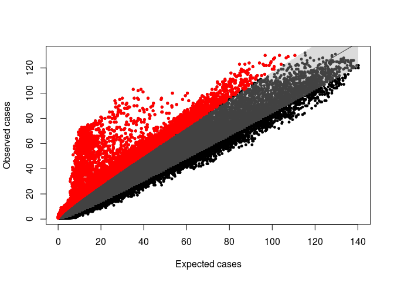
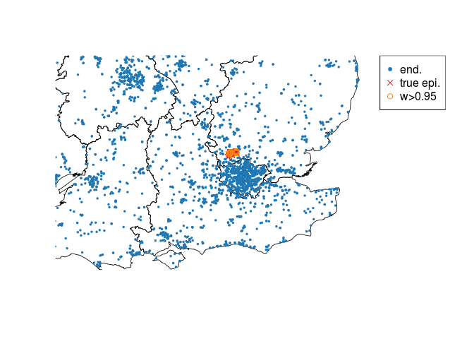

# Rancovr: Cluster detection in R with Random Neighbourhood Covering

`rancovr` is a statistical software package written in R for disease
cluster and anomaly detection. It implements the Random Neighbourhood
Covering (RaNCover) approach of reference \[1\]. RaNCover assigns a
score *w* ∈ \[0, 1\] to each record. A high score suggests that a
record is likely to be part of a cluster (e.g., it is an infection case
caused by a local outbreak), while a low score suggests that the record
is consistent with a baseline of sporadic cases.

``` r
install.packages("devtools")
devtools::install_github("mcavallaro/rancovr")
```

As a demonstration, we consider the spatio-temporal coordinates in
`Data/synthetic_dataset.csv`. The entries of this data set represent
(simulated) locations and detection dates of infected patients generated
by an endemic disease (`end.`) and cases due to a local outbreak
(`epi.`) in England. See also reference \[1\] for the simulation
details.

``` r
data("simulation_data")
head(simulation_data)
```

    ##   postcode week population  sim type latitude  longitude Postcode Total
    ## 1  AL100AZ   59         67 epi.    1 51.76421 -0.2309368  AL100AZ    67
    ## 2  AL100AZ   41         67 epi.    2 51.76421 -0.2309368  AL100AZ    67
    ## 3  AL100AZ   51         67 epi.    2 51.76421 -0.2309368  AL100AZ    67
    ## 4  AL100DR   50         64 epi.    1 51.76370 -0.2360576  AL100DR    64
    ## 5  AL100DR   47         64 epi.    1 51.76370 -0.2360576  AL100DR    64
    ## 6  AL100DR   51         64 epi.    1 51.76370 -0.2360576  AL100DR    64
    ##          y         x
    ## 1 5756.180 -8.074648
    ## 2 5756.180 -8.074648
    ## 3 5756.180 -8.074648
    ## 4 5756.123 -8.254003
    ## 5 5756.123 -8.254003
    ## 6 5756.123 -8.254003

``` r
data("GB_region_boundaries")
plotBaseMap(add=F, xlim=range(simulation_data$longitude), ylim=range(simulation_data$latitude))
points(simulation_data$longitude, simulation_data$latitude,
       col=ifelse(simulation_data$sim=='epi.', tab.red, tab.blue),
       pch=ifelse(simulation_data$sim=='epi.', 1, 20),
       cex=ifelse(simulation_data$sim=='epi.', 0.6, 0.2))
legend('topright',c('end.','epi.'), pch=c(20,1), col=c(tab.blue, tab.red))
```

 For
convenience, all observations are arranged in a `sparseMatrix` object
named `observation.matrix` and saved on disk.

``` r
CreateObservationMatrices(simulation_data)
```

    ## The variable `observation.matrix` has been saved on disk in file `/home/massimo/Documents/rancovr/observation_matrix.RData`.
    ## Load on memory with `load("/home/massimo/Documents/rancovr/observation_matrix.RData", verbose=1)`.

Observations must be compared with an appropriate baseline model. If the
numbers of these observations significantly exceeded the model
prediction, an outbreak might be occurring. Estimating the baseline
involves finding a temporal trend (using the function `TimeFactor`) and
a spatial trend based on the spatial population distribution.

``` r
load(file.path(getwd(), "observation_matrix.RData"), verbose=1)
```

    ## Loading objects:
    ##   observation.matrix

``` r
time.factor = TimeFactor(simulation_data, n.iterations=5)
```

    ## Computing the temporal baseline.
    ## Estimating parameters for temporal trend, step  1  of  5 .Estimating parameters for temporal trend, step  2  of  5 .Estimating parameters for temporal trend, step  3  of  5 .Estimating parameters for temporal trend, step  4  of  5 .Estimating parameters for temporal trend, step  5  of  5 .The variable `Parameters` has been saved on disk in file `/home/massimo/Documents/rancovr/timefactor_parameters.RData`.
    ## Load on memory with `load("/home/massimo/Documents/rancovr/timefactor_parameters.RData", verbose=1)`.
    ## The variable `time.factor` has been saved on disk in file `/home/massimo/Documents/rancovr/timefactor.RData`.
    ## Load on memory with `load("/home/massimo/Documents/rancovr/timefactor.RData", verbose=1)`.

``` r
baseline.matrix = CreateBaselineMatrix(simulation_data, save.on.dir = T)
```

    ## Temporal baseline loaded.
    ## Compiling the table that maps the rows of the observation/baseline matrix to geo-coordinates and population.
    ## Loading objects:
    ##   postcode2coord

    ## Warning in as.character(postcode2coord[, postcode.field]) == rownames(matrix):
    ## longer object length is not a multiple of shorter object length

    ## Data loaded from `postcode2coord.RData` is for a different matrix and will be overwritten by the map for the current matrix.
    ## The variable `postcode2coord` has been saved on disk in file `/home/massimo/Documents/rancovr/postcode2coord.RData`.
    ## Load on memory with `load("/home/massimo/Documents/rancovr/postcode2coord.RData", verbose=1)`.
    ## The variable `baseline.matrix` has been saved on disk in file `/home/massimo/Documents/rancovr/baseline_matrix.RData`.
    ## Load on memory with `load("/home/massimo/Documents/rancovr/baseline_matrix.RData", verbose=1)`.

``` r
load(file.path(getwd(), "observation_matrix.RData"), verbose=1)
```

    ## Loading objects:
    ##   observation.matrix

``` r
plot(time.factor, xlab = 'Week', ylab='Number of cases', xaxt='n')
# lines(colSums(baseline.matrix))
points(Matrix::colSums(observation.matrix), pch='+')
axis(side=1, at=1:length(time.factor), labels = names(time.factor))
legend('bottomright',legend=c('Baseline', 'Observations'), pch=c('o', '+'))
```


Create 100,000 cylinders to cover the observed cases using the estimated
baseline.

``` r
cylinders = CreateCylinders(observation.matrix, baseline.matrix, week.range = c(0,99), n.cylinders = 100000)
```

    ## Compiling the table that maps the rows of the observation/baseline matrix to geo-coordinates and population.
    ## Loading objects:
    ##   postcode2coord
    ## Using data loaded from `postcode2coord.RData`
    ## Time difference of 2.711282 mins

``` r
head(cylinders)
```

    ##             x        y      rho t.low t.upp n_obs         mu        p.val
    ## 1  -67.146412 5769.807 8.163869    73    86     4  1.4463302 5.908811e-02
    ## 2  -48.661207 5657.672 6.752909    16    35     6  4.9730974 3.793189e-01
    ## 3   -6.483721 5755.764 8.497225    45    57    52  7.1205952 2.478737e-27
    ## 4    4.666002 5739.594 8.497225    51    63    30 28.9189980 4.448458e-01
    ## 5  -82.407466 6106.174 9.811750    11    20     1  0.8217982 5.603596e-01
    ## 6 -202.852164 5593.081 8.497225    51    63     4  1.4597384 6.069135e-02
    ##   warning
    ## 1   FALSE
    ## 2   FALSE
    ## 3    TRUE
    ## 4   FALSE
    ## 5   FALSE
    ## 6   FALSE

Some cylinders contain much more cases than the baseline predicts. These
cylinders cover epidemic (outbreak) events.

``` r
plotCylindersCI(cylinders, confidence.level = 0.95)
```


The “true” baseline matrix used to generate the endemic events is
available as `data()`. Let’s use it in place of the estimated baseline
matrix. Notice that the true baseline matrix has higher dimensionality
than the estimated baseline matrix (it includes entries for more
postcodes and times) and requires a matching observation matrix.

``` r
print(dim(baseline.matrix))
```

    ## [1] 3446  101

``` r
print(dim(observation.matrix))
```

    ## [1] 3446  101

``` r
data(baseline_for_sim)
print(dim(baseline_for_sim))
```

    ## [1] 10000   101

``` r
CreateObservationMatrices(simulation_data,
                          more.postcodes=rownames(baseline_for_sim),
                          more.weeks=colnames(baseline_for_sim))
```

    ## Warning in unlist(as.integer(more.weeks)): NAs introduced by coercion

    ## Warning in unlist(as.integer(more.weeks)): NAs introduced by coercion

    ## The variable `observation.matrix` has been saved on disk in file `/home/massimo/Documents/rancovr/observation_matrix.RData`.
    ## Load on memory with `load("/home/massimo/Documents/rancovr/observation_matrix.RData", verbose=1)`.

``` r
load("/home/massimo/Documents/rancovr/observation_matrix.RData", verbose=1)
```

    ## Loading objects:
    ##   observation.matrix

``` r
print(dim(observation.matrix))
```

    ## [1] 10000   101

``` r
cylinders.2 = CreateCylinders(observation.matrix, baseline_for_sim, week.range = c(0,99), n.cylinders = 100000)
```

    ## Compiling the table that maps the rows of the observation/baseline matrix to geo-coordinates and population.
    ## Loading objects:
    ##   postcode2coord

    ## Warning in as.character(postcode2coord[, postcode.field]) == rownames(matrix):
    ## longer object length is not a multiple of shorter object length

    ## Data loaded from `postcode2coord.RData` is for a different matrix and will be overwritten by the map for the current matrix.
    ## The variable `postcode2coord` has been saved on disk in file `/home/massimo/Documents/rancovr/postcode2coord.RData`.
    ## Load on memory with `load("/home/massimo/Documents/rancovr/postcode2coord.RData", verbose=1)`.
    ## Time difference of 4.289573 mins

``` r
head(cylinders.2)
```

    ##             x        y      rho t.low t.upp n_obs        mu       p.val warning
    ## 1    6.678267 5739.376 11.57249    61    80    69 50.048042 0.006371698    TRUE
    ## 2  -61.256464 5990.645 29.12347    13    16    18 14.994925 0.250711342   FALSE
    ## 3  -39.164635 5993.963 14.56173    34    46     9  7.299818 0.310751009   FALSE
    ## 4  -80.617268 5957.438 15.20923    88    99    14 15.389119 0.672984536   FALSE
    ## 5  -53.665732 5691.094 17.83441    14    22     3  2.850717 0.542547486   FALSE
    ## 6 -139.710085 5747.082 10.29670    57    81     8  8.312945 0.589804564   FALSE

``` r
plotCylindersCI(cylinders.2, confidence.level = 0.95)
```



Compute the warning scores for each case:

``` r
simulation_data[,'warning.score'] = apply(simulation_data, 1, FUN=warning.score, cylinders)
simulation_data[,'warning.score.2'] = apply(simulation_data, 1, FUN=warning.score, cylinders.2)
head(simulation_data)
```

    ##   postcode week population  sim type latitude  longitude Postcode Total
    ## 1  AL100AZ   59         67 epi.    1 51.76421 -0.2309368  AL100AZ    67
    ## 2  AL100AZ   41         67 epi.    2 51.76421 -0.2309368  AL100AZ    67
    ## 3  AL100AZ   51         67 epi.    2 51.76421 -0.2309368  AL100AZ    67
    ## 4  AL100DR   50         64 epi.    1 51.76370 -0.2360576  AL100DR    64
    ## 5  AL100DR   47         64 epi.    1 51.76370 -0.2360576  AL100DR    64
    ## 6  AL100DR   51         64 epi.    1 51.76370 -0.2360576  AL100DR    64
    ##          y         x warning.score warning.score.2
    ## 1 5756.180 -8.074648     0.8711019       0.8396465
    ## 2 5756.180 -8.074648     0.8900256       0.7675676
    ## 3 5756.180 -8.074648     0.9727149       0.9410526
    ## 4 5756.123 -8.254003     0.9842932       0.9739312
    ## 5 5756.123 -8.254003     0.9815603       0.9662542
    ## 6 5756.123 -8.254003     0.9744280       0.9413613

Assess concordance with ROC-AUC:

``` r
library(pROC)
```

    ## Type 'citation("pROC")' for a citation.

    ## 
    ## Attaching package: 'pROC'

    ## The following objects are masked from 'package:stats':
    ## 
    ##     cov, smooth, var

``` r
ROC = roc(ifelse(simulation_data$sim == 'end.', FALSE, TRUE), simulation_data$warning.score)
```

    ## Setting levels: control = FALSE, case = TRUE

    ## Setting direction: controls < cases

``` r
plot(ROC)
print(ROC$auc)
```

    ## Area under the curve: 0.9993

``` r
ROC = roc(ifelse(simulation_data$sim == 'end.', FALSE, TRUE), simulation_data$warning.score.2)
```

    ## Setting levels: control = FALSE, case = TRUE
    ## Setting direction: controls < cases

``` r
plot(ROC, add=T, col='red')
print(ROC$auc)
```

    ## Area under the curve: 0.9993

``` r
legend('bottomright', legend =  c('Using estimated baseline', 'Using true baseline'), lty=1, col=c('black','red'))
```


With mean squared error:

``` r
simulation_data$Y = ifelse(simulation_data$sim == 'epi.',1,0)
simulation_data$sqerr = (simulation_data$Y - simulation_data$warning.score)^2
cat("MSE using estimated baseline:", mean(simulation_data$sqerr), '\n') 
```

    ## MSE using estimated baseline: 0.02625492

``` r
simulation_data$sqerr.2 = (simulation_data$Y - simulation_data$warning.score.2)^2
cat("MSE using true baseline:", mean(simulation_data$sqerr.2), '\n') 
```

    ## MSE using true baseline: 0.0318318

And with a map:

``` r
data("GB_region_boundaries")
#plotBaseMap(add=F, xlim=c(-0.6,0.6), ylim=c(51.648,51.65))
plotBaseMap(add=F, xlim=c(-1,1), ylim=c(50.648,52.65))
points(simulation_data$longitude, simulation_data$latitude,
       col=ifelse(simulation_data$sim=='epi.', tab.red, tab.blue),
       pch=ifelse(simulation_data$sim=='epi.', 4, 20),
       cex=ifelse(simulation_data$sim=='epi.', 1, 0.5))
points(simulation_data[simulation_data$warning.score>0.95,]$longitude,
       simulation_data[simulation_data$warning.score>0.95,]$latitude,
       col=tab.orange,
       pch=1,
       cex=1)
# case.df$color = rgb(colorRamp(c("blue", "red"))(case.df$warning.score) / 255)
# plot(case.df$longitude, case.df$latitude, col=case.df$color)

legend('topright',c('end.','true epi.', 'w>0.95'), pch=c(20,4,1), col=c(tab.blue, tab.red, tab.orange))
```



``` r
plotBaseMap(add=F, xlim=c(-0.6,0.6), ylim=c(51.648,51.65))
#plotBaseMap(add=F, xlim=c(-1,1), ylim=c(50.648,52.65))
points(simulation_data$longitude, simulation_data$latitude,
       col=ifelse(simulation_data$sim=='epi.', tab.red, tab.blue),
       pch=ifelse(simulation_data$sim=='epi.', 4, 20),
       cex=ifelse(simulation_data$sim=='epi.', 1, 0.5))
points(simulation_data[simulation_data$warning.score.2>0.95,]$longitude,
       simulation_data[simulation_data$warning.score.2>0.95,]$latitude,
       col=tab.orange,
       pch=1,
       cex=1)
# case.df$color = rgb(colorRamp(c("blue", "red"))(case.df$warning.score) / 255)
# plot(case.df$longitude, case.df$latitude, col=case.df$color)

legend('topright',c('end.','true epi.', 'w>0.95'), pch=c(20,4,1), col=c(tab.blue, tab.red, tab.orange))
```


\[1\] M. Cavallaro, J. Coelho, D. Ready, V. Decraene, T. Lamagni, N. D.
McCarthy, D. Todkill, M. J. Keeling (2022) Cluster detection with random
neighbourhood covering: Application to invasive Group A Streptococcal
disease. PLoS Comput Biol 18(11): e1010726.
<https://doi.org/10.1371/journal.pcbi.1010726>
